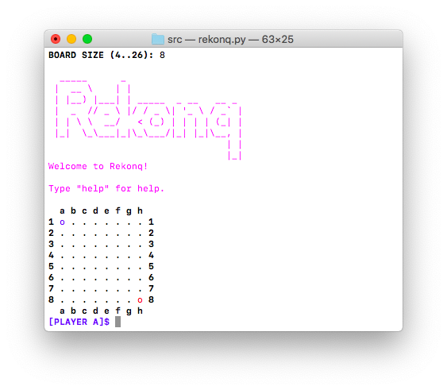

# Rekonq



Rekonq is a strategy game in which you shall conquer to win. When a cell is
conquered again by the opposite player, stays conquered permanently. The goal
is to conquer most of the board.

## How to play

You can find the game instructions at `docs/howto.md`. For more details about how to use each command, type "help".

## Run

```bash
screen python3 rekonq.py
```

**Note:** _screen_ is optional, but required when no GUI is available
  (in text mode console) to display colors properly in Unix-like systems.

## Usage

Expand from cell `a1` to `b2` and put a `*`

```
[PLAYER A]$ a1 b2 *
```

Get a list of all the available commands and how to use them.

```
[PLAYER B]$ help
```

## Windows

<a href="http://cmder.net">Cmder</a> is needed to display colors properly in Windows.

## Android

1. Download <a href="https://play.google.com/store/apps/details?id=com.termux">Termux</a> from Google Play. 
2. Write the following commands:

```bash
pkg install git python
git clone https://github.com/ivan-avalos/rekonq.git
cd rekonq/src
python rekonq.py
```

## License

```
Rekonq - Strategy game in which you shall conquer to win.
Copyright (C) 2018  Iván Alejandro Ávalos Díaz <ivan.avalos.diaz@hotmail.com>
This program is free software: you can redistribute it and/or modify
it under the terms of the GNU General Public License as published by
the Free Software Foundation, either version 3 of the License, or
(at your option) any later version.
This program is distributed in the hope that it will be useful,
but WITHOUT ANY WARRANTY; without even the implied warranty of
MERCHANTABILITY or FITNESS FOR A PARTICULAR PURPOSE.  See the
GNU General Public License for more details.
You should have received a copy of the GNU General Public License
along with this program.  If not, see <https://www.gnu.org/licenses/>.
```
