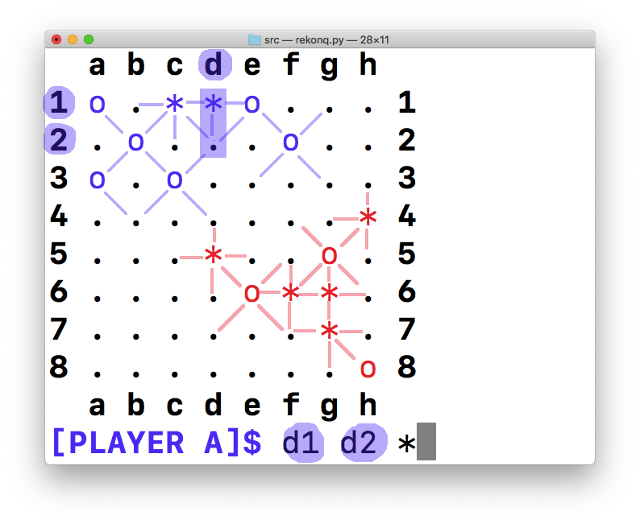
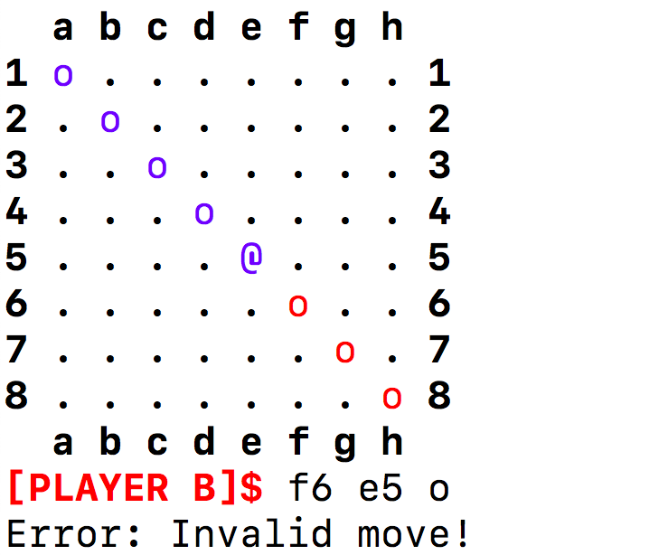

# How to play Rekonq

You can find more information about how to use this program in the README file, included in the root directory. To see all the available commands, type "help" in the shell.

## Step 1. The board

The board is initialized with both players placed in the opposite corners. The movements are written in the interactive shell as commands, after the `$`. You can specify the size of the board.

### Players

| Color          | Player   |
|----------------|----------|
| Blue or purple | Player A |
| Red            | Player B |

### Cells

| Normal | Reconquered |  Description             |
|--------|-------------|--------------------------|
|`.`     |             | Empty cell.              |
|`*`     |`#`          | Cell with `+` expansion. |
|`o`     |`@`          | Cell with `x` expansion. |

## Step 2. Expansion

You can use your cells to expand your "kingdom" and conquer more cells. The direction toward which a cell can conquer is determined by the symbol of the cell (explained above). You can expand only one cell per movement toward the correspondent direction. When you conquer a cell, the symbol of the new cell can be `*` or `o`. 

In the example, you expand from the cell `d1` to `d2` and put a `*` cell.

## Step 3. "Reconquer" cells

When you reconquer a cell from the opposite player, you become the perpetual owner of that cell. That means, that the opposite player won't be able to take it again, so it becomes permanent and you can expand more. You can decide the symbol of your new cell too, (`*=#` and `o=@`). If you try to take back a reconquered cell, you will get an error.

## Step 4. End of the game

The game ends when one of the players (or both) runs out of movements. That happens when almost every cell in the board is reconquered and you can't expand to any direction.

## Step 5. Winner

The player with the highest number of conquered cells at the end of the game is the winner. When both players have the same number of cells, tie is declared.

## Step 6. Have fun!

This is the most important step. I hope you enjoy playing this game. For more information about how to install and use, again, read the README file in the root directory or type "help" in the interactive shell.